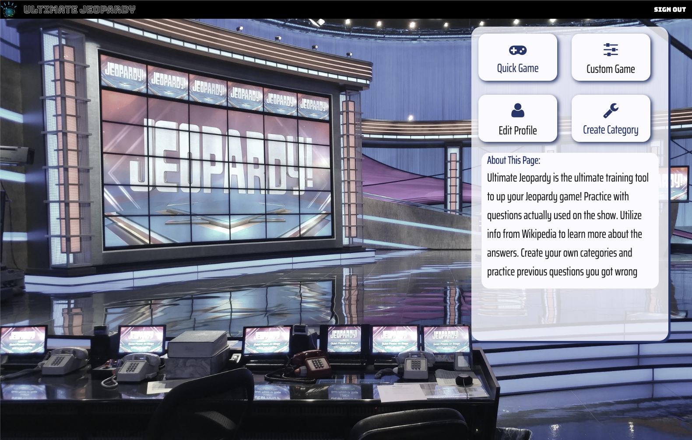
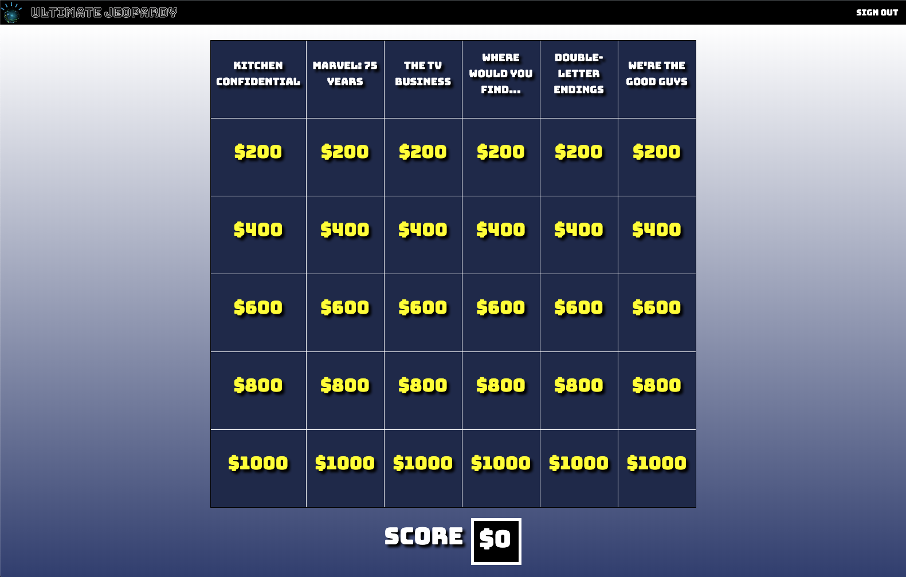
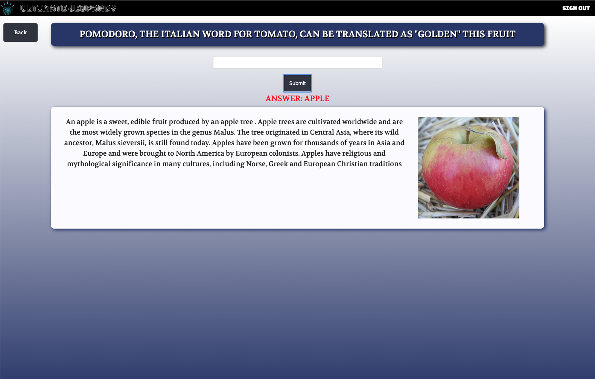

# Ultimate Jeopardy

### Launch Academy - Breakable Toy

Ultimate Jeopardy is a React/Rails app featuring the trivia game Jeopardy. Once the user answers a question, the React show page renders a tile with information and pictures pulled from Wikipedia to give more information on the answer. I learned how to utilize the Wikipedia API and Jeopardy (jservice) API to seed my database with questions and text from Wikipedia entries. I primarily used custom CSS to create the Jeopardy board and page layouts. User authentication is facilitated with the Devise Gem so that users can login and create their own Jeopardy questions.

I love the show Jeopardy! I'm not the best at trivia, so I really wanted to build a tool that would improve my Jeopardy game. I would often pause the show to look up an answer I didn't get on Wikipedia, so I thought it would be nice if that was automated. I also chose to build this app because games are fun and I see potential to expand its functionality. I've set up my tables in a way that users can recall questions they've previously answered incorrectly. I'd also like to learn how to use Action Cable to potentially set up an online multiplayer game.

### TODO List
* Add Custom Game functionality with React Search bar so that user can choose which categories to use (including their
  own custom categories
* Add User Profile page, so that user can view their high scores and replay questions they previously answered incorrectly.
* Implement ActionCable and websockets for multiplayer
